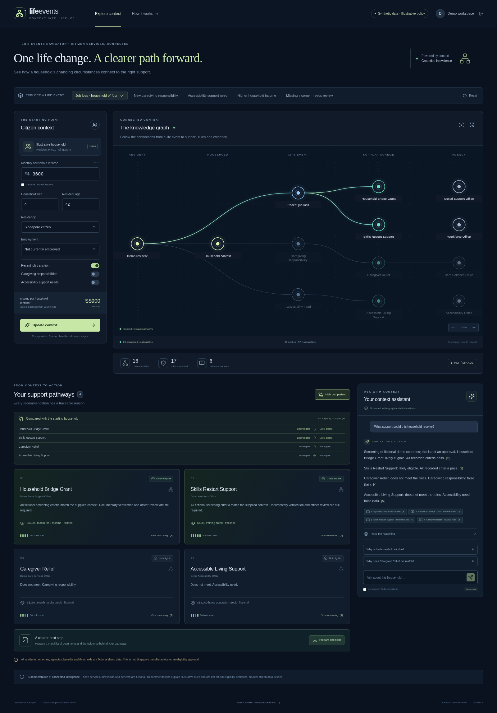

# Singapore Life Events Navigator

A public sector demonstration of knowledge graphs and context intelligence: see how a resident's changing circumstances affect discovery of relevant services, with an inspectable path from household facts to eligibility rules, policy evidence, documents, and agencies.

**All resident profiles, programmes, policy thresholds, benefits, and agency workflows are synthetic. This is an illustrative demo, not Singapore government eligibility advice or an approval system.** No personal data is required.

[Open the deployed demo](https://d1pbdc1b2fpdk2.cloudfront.net). Cognito sign-in is required; credentials are distributed separately.



## Deployment target

- Region: `us-east-1`, as selected for this demo.
- Frontend: private Amazon S3 bucket, served over HTTPS by Amazon CloudFront using Origin Access Control.
- Login: Amazon Cognito hosted sign-in, authorization code flow with PKCE.
- API: Amazon API Gateway with a Cognito JWT authorizer, AWS Lambda.
- Context: RDF/OWL ontology, SPARQL-derived rule evaluation, components from [AWS Context Ontology Accelerator](https://github.com/aws/context-ontology-accelerator) release `v0.3.4`.
- Optional grounded narrative: Amazon Bedrock. Eligibility is evaluated by explicit rules, separately from narrative generation.

This compact demo reuses accelerator components; it is **not a deployment of the complete accelerator platform**. Separate schema and instance data exports support a later integration with its Scan → Model → Serve workflow.

## Demo story

1. Discover support for a synthetic household after a job transition.
2. Inspect the graph linking the household to scheme rules and supporting policy evidence.
3. Change income or caregiving context and compare the assessment.
4. Inspect unmet or unknown conditions, prepare a document checklist, and ask a grounded question.

## Run locally

Prerequisites: Python 3.12, Node.js 22 or later, and npm.

```bash
make install
make test
make dev-api
```

In another terminal, run `make dev-web`, then open `http://localhost:5173`. Local preview works only on loopback hosts. Deployed configuration disables it and requires Cognito login.

The **Job loss · household of four** preset starts at S$3,600 household income and two likely eligible fictional schemes. **New caregiving responsibility** changes income to S$5,400 and opens a caregiving pathway while excluding the bridge grant. **Missing income · needs review** demonstrates uncertainty. Click a scheme to inspect its rules, documents, and evidence; select **Compare changes** to compare with the starting household.

## Deploy to AWS

Use credentials for the intended account, then:

```bash
source .venv/bin/activate
python scripts/deploy.py --enable-bedrock
python scripts/create_user.py demo.architect --credentials-file artifacts/demo-login.local.json
python scripts/check_deployment.py
```

The deployment script builds and uploads both application packages, provisions two CloudFormation stacks, sets the exact frontend origin, and saves non-secret outputs in ignored `deployment.json`. The user creation script saves generated credentials to an ignored file with owner-only permissions and never prints the password. See [operations](infra/OPERATIONS.md) for the managed environment's credential selector, deployment updates, cost controls, and cleanup.

Amazon Bedrock narration is optional and selected in the assistant. Its input includes the actual accelerator traversal entities and relationships, rule results, and policy evidence. The response identifies whether synthesis succeeded or used a deterministic fallback. Both paths preserve the same explicit screening outcomes.

## Validation and source

```bash
python -m unittest discover -s backend/tests -v
python -m unittest discover -s infra/tests -v
cd frontend && npm run build
```

Backend checks cover changed household context, eligibility boundaries, unknown facts, changed RDF policies, evidence links, bounded questions, and genuine traversal context passed to synthesis. Infrastructure checks cover private origins, scoped authentication, dependency cycles, SPA routing, caching, and Lambda permissions. The GitHub workflow runs backend and infrastructure checks and the frontend build without AWS credentials.

The accelerator source is pinned to `v0.3.4`, commit `c84a3043a989c30fe33658c763f5f279c6981aba`. Reused files retain their notices and Apache-2.0 license; see [component provenance](backend/vendor/PROVENANCE.md). The demo's schema has 77 triples; synthetic instance data has 556 triples. The visual graph contains 36 entities and 57 relationships.

Useful guides:

- [Five-minute presenter walkthrough](docs/presenter.md)
- [Architecture and graph reasoning](docs/architecture.md)
- [Integration into the full Context Ontology Accelerator](docs/accelerator-integration.md)
- [AWS operations and cleanup](infra/OPERATIONS.md)
- [Deployed validation results](docs/validation.md)
- [Importable OWL/Turtle ontology](backend/data/ontology.ttl)
- [Separate synthetic instance data](backend/data/instances.ttl)

AWS charges accrue while deployed. The compact implementation uses request-based services and optional model inference; it does not provision a Neptune cluster, OpenSearch capacity, or a NAT gateway.

Licensed under Apache-2.0; see [LICENSE](LICENSE). Upstream source notices are retained in the vendored components.
