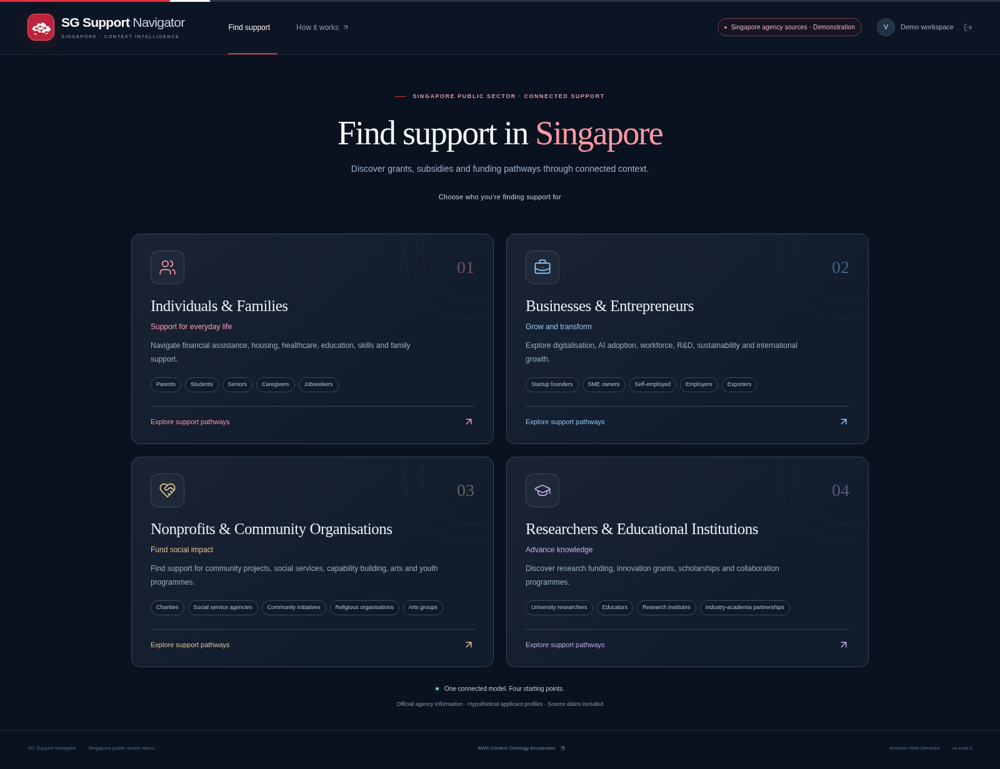
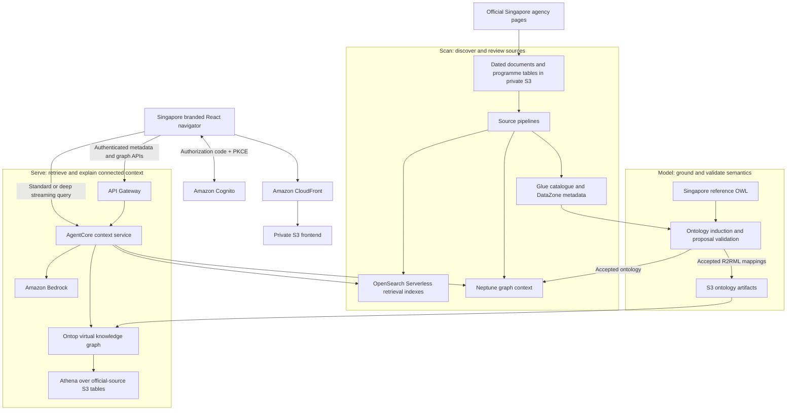

# SG Support Navigator

A Singapore public sector demonstration of knowledge graphs and context intelligence using [AWS Context Ontology Accelerator](https://github.com/aws/context-ontology-accelerator). Four audience entry points connect hypothetical applicant needs with **20 real support programmes from 10 official agency sources**.

The full-platform edition uses **Scan → Model → Serve**, with private **S3 + CloudFront** hosting and **Cognito** login in **`us-east-1`**. Its Singapore identity combines red and white accents, a connected Singapore island mark and a local skyline. This is an independent demonstration using public agency information. Agencies assess eligibility and approve applications; the navigator provides attributed programme information and requirements to verify.

[CloudFront demo entry point](https://d1pbdc1b2fpdk2.cloudfront.net) · Cognito credentials are distributed privately.

**Deployment status:** the full platform is deployed, all 20 official policy documents are processed, and reviewed ontology/mappings are accepted. Live source, graph, Athena, Ontop, document retrieval and AgentCore deep-reasoning checks passed. The branded navigator was published on **8 October 2026 at 09:14:55 UTC**. Actual Cognito hosted-login/PKCE, all four audience journeys, mobile layout and an explicit deep-reasoning follow-up passed browser verification. Every verified answer was substantive, unblocked and complete. See the [full-platform validation record](docs/full-platform-validation.md); [compact validation](docs/validation.md) covers the separate earlier edition.



[View the live Individuals & Families workspace](docs/demo-full-individuals.png), including its returned graph, official programme evidence and context answer.

## Four starting points

| Audience | Programmes in the current official-source capture |
| --- | --- |
| Individuals & Families — 7 | ComCare, CHAS, SkillsFuture Credit, preschool subsidies and MOE financial assistance |
| Businesses & Entrepreneurs — 4 | EDGE, Energy Efficiency Grant and Enterprise Financing Scheme support |
| Nonprofits & Community Organisations — 5 | NCSS organisation/people development and NAC arts/capability funding |
| Researchers & Educational Institutions — 4 | NRF research programmes and A*STAR industry collaboration funding |

The [source catalogue](data/official/catalogue.json) was captured on **8 October 2026**. Each programme carries an official URL, capture time, source hash, administering agency, curated summary and verbatim evidence. [Source coverage and limitations](docs/singapore-sources.md) list all programmes and unavailable pages. This is a bounded capture; housing grants and every possible support category are not covered. A published page does not prove that its funding call is open.

The current Enterprise Singapore evidence records the transition from EDG, PSG and MRA, which ceased on 29 September 2026, to EDGE. The demo preserves these lifecycle statements so programme discovery can account for changing policy context.

## Connected context



Programme cards come from the attributed public catalogue. Answers and execution traces come from the deployed accelerator. The visual graph renders entities and relationships returned by the platform; if a query returns no entity graph, an available live ontology schema is explicitly labelled as such. Hypothetical applicant inputs supply question context and are not authoritative records in the source graph.

Change a household, organisation or research-project input and ask what requirements need checking. Open source evidence and inspect **Trace the reasoning** to see which retrieval and query steps actually ran. Support-type chips narrow browsing. Official programme cards remain **Agency assessment required**; source prose is not converted into the compact demo's automatic eligibility rules. Partial answers and platform errors are displayed explicitly.

Audience entry uses standard AgentCore streaming by default; the four verified initial answers took **28–41 seconds**. Select **Deep context reasoning** for a separate, longer investigation and allow roughly **2–3 minutes**. The live browser deep follow-up returned 20 supporting passages and 18 actual trace steps in 131 seconds. These are observed runs, not latency guarantees.

## Full-platform deployment

The accelerator is pinned to **v0.3.4**, commit `c84a3043a989c30fe33658c763f5f279c6981aba`. The [project patch](platform/patches/0001-singapore-demo.patch) adds demo sizing, origin configuration, reviewed prompt-attack calibration and suppressed Cognito invitations. The core deployment comprises 16 stacks named `sgsupport-demo-*`; configuration uses `/sgsupport/config`.

Install the [operator dependencies](platform/requirements.txt), then follow [full-platform operations](docs/full-platform-operations.md):

```bash
python -m venv .venv
source .venv/bin/activate
python -m pip install -r platform/requirements.txt
python platform/deploy-full.py package --source /workspace/context-ontology-accelerator
python platform/deploy-full.py prepare
python platform/deploy-full.py start --phase build
python platform/deploy-full.py status --build-id 'sgsupport-full-platform:<build-id>'
python platform/deploy-full.py start --phase deploy --assembly 's3://<project-build-bucket>/builds/<completed-build-artifact>.zip'
```

Use credentials for the intended account. The helper restricts AWS operations to account `879594333699` and `us-east-1`; the operations guide explains this managed session's missing-profile workaround. CodeBuild performs mixed-architecture builds on a disposable managed host. Deploy only a completed assembly, with VPC quota and endpoint availability checked.

After provisioning, [ingest the official sources](scripts/full_platform_ingest.py) through the real Scan/Model APIs and run [live validation](scripts/full_platform_checks.py). The workflow stages private S3/Glue data, reviews scanned metadata, imports the [Singapore reference ontology](platform/singapore-support-ontology.ttl), induces mappings, validates the proposal and publishes accepted artifacts. It checkpoints asynchronous jobs and does not write fabricated results directly to Neptune.

```bash
python scripts/official_sources.py verify
python scripts/full_platform_ingest.py \
  --metadata artifacts/full-platform.json \
  --credentials artifacts/full-platform-login.local.json --stage all --document-limit 0
python scripts/full_platform_checks.py \
  --metadata artifacts/full-platform.json \
  --credentials artifacts/full-platform-login.local.json --check all
```

The default ingestion limit is six policy documents covering all audiences; `--document-limit 0` stages the full document capture. Verify deep AgentCore streaming separately with `--check deep`. Keep generated passwords and checkpoint files private and ignored by Git. Refresh dated sources deliberately, review policy changes, then rescan and update models; the catalogue is not continuously synchronised with agencies.

**Standing infrastructure estimate: approximately US$1,320–2,020 per 730-hour month before usage, storage and active VKG tasks.** OpenSearch, Neptune, ECS, NAT and private endpoints incur charges while idle. See the [rate assumptions and teardown procedure](docs/full-platform-operations.md). Deployment in `us-east-1` and US Bedrock inference routing are deliberate demo choices; they do not establish Singapore data residency.

## Synthetic compact mode for local/offline demonstrations

The repository also retains the earlier compact implementation. Its **15 fictional programmes, thresholds, agency labels and profiles are synthetic**. It uses in-memory RDFLib/SPARQL, reused accelerator traversal components and optional Bedrock narration. This mode provides a small, repeatable graph/rule demonstration without the full platform's managed services. After dependencies are installed, deterministic local mode can run without AWS connectivity.

Prerequisites: Python 3.12, Node.js 22 or later, and npm.

```bash
make install
make test
make dev-api
```

In another terminal, run `make dev-web`, then open `http://localhost:5173`. The checked-in local configuration enables preview only on loopback hosts. Choose an audience, edit the synthetic context and inspect rule checks. Deployed configuration disables local preview and requires Cognito. Full mode is selected by `platform.mode: "full"` in frontend runtime configuration and uses the full platform's Cognito ID-token contract.

Compact AWS deployment remains available through `scripts/deploy.py`, `scripts/create_user.py` and `scripts/check_deployment.py`; [compact operations](infra/OPERATIONS.md) describe its two CloudFormation stacks. Those resources and their cleanup are separate from the full platform.

## Guides and validation

- [Full-platform presenter walkthrough](docs/full-platform-presenter.md)
- [Official Singapore source inventory and refresh](docs/singapore-sources.md)
- [Full-platform operations, pricing and teardown](docs/full-platform-operations.md)
- [Full-platform deployment and validation record](docs/full-platform-validation.md)
- [Exact accelerator API/integration contracts](docs/accelerator-integration.md)
- [Compact synthetic presenter walkthrough](docs/presenter.md)
- [Compact architecture and rule semantics](docs/architecture.md)
- [Compact deployed validation record](docs/validation.md)
- [Vendored component provenance](backend/vendor/PROVENANCE.md)

`make test` validates the compact backend/infrastructure and builds the shared frontend. The AWS-free GitHub workflow is not a substitute for the full platform's live source, graph, Athena, Ontop, retrieval and streaming checks.

Licensed under Apache-2.0; see [LICENSE](LICENSE). Reused upstream components retain their source notices.
