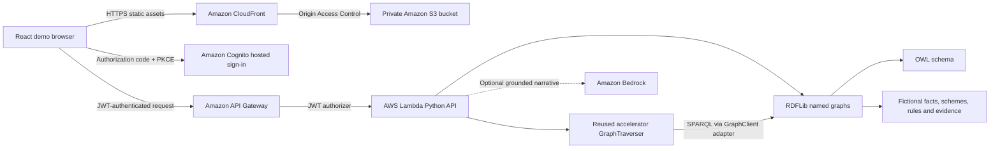

# Life Events Navigator: architecture and design

This demo helps a resident or service officer understand which fictional support programmes fit a changing household context, why each programme appears, and which evidence would be needed next. It shows how an explicit knowledge model makes an answer inspectable and makes a change in circumstances visible.

All profiles, schemes, agencies, benefits, thresholds, and policy excerpts are invented for this demonstration. The labels and Singapore-dollar amounts create a local public-sector story; they do not describe actual Singapore government programmes. The output is a screening illustration, not an eligibility approval, legal advice, or an application workflow.

## Implemented deployment

The deployment region is **`us-east-1`**, selected by the user. Singapore is the scenario context, not the location of the deployed data plane. This choice should be stated when discussing the demo with customers; a future customer deployment would choose its region and model routing deliberately.



The browser serves an interactive graph, household context controls, scheme assessments, rule results, source evidence, a document checklist, and a question interface. Cognito gates the deployed experience. The API validates the caller's JWT before invoking the Lambda. A public local preview is a developer convenience and is separate from the deployed authenticated experience.

The Lambda loads a small, versioned synthetic graph. There is no managed graph database in this compact implementation. An RDFLib adapter runs SPARQL against an in-memory `Dataset`, while the upstream accelerator traversal component receives its normal `GraphClient` interface. The dataset uses `https://demo.example.gov.sg/graph/life-events/instances` and `/ontology` named graphs; these are illustrative identifiers, not network services. Graph definitions and policy evidence are packaged with the backend; a hypothetical assessment does not update an authoritative resident record.

Amazon Bedrock can generate a narrative from the computed assessment, the supplied evidence, and the actual enriched traversal context. When it is disabled or unavailable, the deterministic explanation still presents rule results and citations. The `engine` response identifies the path used. The narrative layer does not decide whether a screening rule passes.

## Compact API contract

These endpoints belong to this demo, not the full accelerator's namespace API:

| Method and path | Response |
| --- | --- |
| `GET /api/health` | Basic service/scenario status |
| `GET /api/scenario` | Synthetic profile, presets, visual graph nodes/edges, policy evidence |
| `POST /api/analyze` | Screening statuses, rule results, reasoning, citations, enriched graph context, highlighted paths, and actual engine metadata |
| `GET /api/ontology?kind=schema` | Downloadable OWL/Turtle T-Box |
| `GET /api/ontology?kind=instances` | Downloadable synthetic RDF A-Box |

An analysis request contains `profile`, `question`, and Boolean `useBedrock`. For example:

```json
{
  "profile": {
    "householdIncome": 3600,
    "householdSize": 4,
    "age": 42,
    "citizenship": "citizen",
    "employmentStatus": "unemployed",
    "caregiver": false,
    "disability": false,
    "recentJobLoss": true
  },
  "question": "Why does Household Bridge Grant match?",
  "useBedrock": false
}
```

The deployed frontend sends a Cognito **access token** with the custom `life-events/access` scope. The API Gateway JWT authorizer checks issuer, audience/client and scope. This demo's token contract is separate from the full accelerator v0.3.4 browser's ID-token contract.

The question interface supports the fictional catalogue's schemes, income, documents, agencies, and screening context. Deterministic mode selects those themes through a bounded intent/keyword function. It does not provide arbitrary natural-language graph-to-query translation. Unsupported questions return an explicit unsupported answer, rather than introducing external facts. Asking about caregiving does not change the profile; edit the inputs or choose a preset to assess a hypothetical change.

## What graph context adds

Document retrieval finds a relevant passage, such as a paragraph explaining an income threshold. A knowledge graph supplies relationships and typed facts: a resident belongs to a household; household income divided by household size produces the income value a particular rule uses; a scheme has multiple criteria, an administering agency, evidence requirements, and a source policy.

The graph establishes the path used to explain a recommendation. SPARQL retrieves scheme criteria from RDF rule individuals, computes income per person, and evaluates the comparisons against request-scoped context triples. A generic aggregation step derives each scheme's overall status from its criterion results. The accelerator's `GraphTraverser` gathers labelled neighbouring entities and relationships through SPARQL. The response exposes rule checks, reasoning steps, citations, and node/edge identifiers so the frontend can highlight the relevant path. Its enriched traversal results are returned as `context` and supplied to optional Bedrock synthesis alongside the computed scheme assessment and associated evidence records.

The compact demo includes authored policy excerpts, rather than a vector search system over a document corpus. Citations are evidence records attached to the graph. A question can receive a narrative grounded in those records, but the demo does not claim to run the accelerator's full document ingestion, vector retrieval, or agent orchestration pipeline. [Full integration](accelerator-integration.md) explains how to add those services.

## Schema and instance data are separate

| Artifact | Meaning | Typical contents | Full accelerator use |
| --- | --- | --- | --- |
| OWL/Turtle schema, or T-Box | Shared vocabulary and relationship definitions | Resident, Household, LifeEvent, Scheme, EligibilityRule, Agency, Document, Evidence, Relationship; domain/range and datatype properties | Upload as a reference ontology for browsing and grounding |
| RDF/Turtle instances, or A-Box | Concrete fictional scenario and policy records | The demonstration household, four schemes, seventeen rule individuals, policy excerpts, agency and evidence links | Import as instance facts through a separately designed ingestion path, or represent as structured source tables |
| Submitted profile | Facts used for a particular hypothetical assessment | Income, household size, age, citizenship, employment, recent job loss, caregiving, accessibility need | Supply as controlled request context or a permissioned source record |

An ontology upload is not a database import. Uploading the T-Box to the full accelerator does not create household rows, service tables, or virtual knowledge graph mappings. Uploading a Turtle schema also does not automatically turn its rules into a statutory eligibility engine. These distinctions keep the demonstration's current behavior and later integration concrete.

The upstream serializer adds the `owl:Ontology` declaration and version metadata, emits Turtle, and verifies a graph-isomorphic parse round trip. This protects the export's semantic content; it is not a proof that its policy definitions are correct.

## Explicit screening semantics

All criteria for a scheme are conjunctive. Each criterion returns `pass`, `fail`, or `unknown`:

1. If any criterion fails, the scheme is `not-eligible` in this fictional screening.
2. If none fails and at least one required fact is unknown, it is `needs-review`.
3. If all criteria pass, it is `likely-eligible`.

An unknown value is preserved as unknown. For example, missing income does not become zero. A known disqualifying condition can still exclude a scheme even when another fact is missing.

Income per person is gross monthly household income divided by household size. For the default profile, S$3,600 / 4 = S$900. Changing either input changes the derived value before the scheme criteria are evaluated.

| Fictional scheme | Criteria | Illustrative benefit | Evidence types |
| --- | --- | --- | --- |
| Household Bridge Grant | Citizen; age ≥ 21; recent job loss; income per person ≤ S$1,000 | S$450 monthly for three months | Income statement, household declaration, employment transition record |
| Skills Restart Support | Citizen or permanent resident; age 18–60 inclusive; unemployed; recent job loss | S$600 training credit | Employment transition record, training plan |
| Caregiver Relief | Citizen; age ≥ 21; caregiving responsibility; income per person ≤ S$1,800 | S$250 monthly respite credit | Caregiving declaration, income statement, household declaration |
| Accessible Living Support | Citizen; age ≥ 21; synthetic accessibility need flag; income per person ≤ S$2,200 | S$1,200 home adaptation credit | Accessibility assessment, income statement, household declaration |

The document checklist lists illustrative evidence types. It does not collect documents, submit an application, reserve capacity, create a case, or contact an agency. Agency nodes are fictional labels, not service integrations.

## Actual accelerator reuse

The code originates from [AWS Context Ontology Accelerator](https://github.com/aws/context-ontology-accelerator), release `v0.3.4`, commit `c84a3043a989c30fe33658c763f5f279c6981aba`.

| Upstream component | Current use |
| --- | --- |
| `packages/context-manager/src/coa_serve/tier3/graph_traverser.py` | Executes the accelerator's labelled entity and relationship traversal over the demo's RDF dataset |
| `packages/context-manager/src/coa_serve/query_utils.py` | Namespace validation, search terms, SPARQL escaping, and graph prefix handling used by traversal |
| `packages/context-manager/src/coa_serve/clients/base.py` | Defines the `GraphClient` protocol implemented by the RDFLib adapter |
| `libs/common/src/coa_common/constants.py` | Shared validation/constants required by the imported traversal code |
| `packages/ontology-engine/src/coa_ontology/inducer/unstructured/services/serializer.py` | Produces the schema export with ontology metadata and parse round-trip verification |

These source files are vendored with their copyright/SPDX notices and the Apache-2.0 license. The minimal `coa_common` package initializer is a packaging adapter that exports the constants/validator used here, avoiding imports of unrelated AWS SDK clients. The RDFLib implementation, synthetic dataset, policy evaluator, frontend, and Lambda/API infrastructure are this demo's additions.

This is component reuse, not a deployment of the complete accelerator. No claim is made that Neptune, OpenSearch Serverless, DataZone, Ontop, AgentCore, Cedar namespace roles, automatic ontology induction, HermiT, or SHACL validation is running in this compact stack. The importable schema and documented migration path make the next stage practical.

## What can be demonstrated and measured

- **Explainability:** inspect actual values, expected values, comparison operators, rule outcomes, and cited policy records for each programme.
- **Sensitivity to context:** change income or life-event flags and see assessments and highlighted paths change.
- **Uncertainty:** choose missing income and see review states instead of an invented answer.
- **Separation of concerns:** screening results come from explicit rules; a model can express the explanation using supplied context.
- **Portability:** export the ontology separately from the synthetic instance facts for integration into a larger semantic platform.

Do not describe the outcome as improved eligibility accuracy against government decisions: no real programme benchmark is included. The observable outcome is a reproducible, inspectable fictional screening result.

## Cost and lifecycle

This compact stack is mainly request-based: Lambda execution, API requests, CloudFront delivery, S3 requests/storage, Cognito usage, and optional Bedrock tokens. Logs add small storage and ingestion charges. No continuously provisioned Neptune instance, OpenSearch OCU floor, Fargate service, or NAT gateway is required by the demo architecture. Actual charges depend on region, traffic, retention, and model selection; use current pricing and the deployed account's billing tools for an estimate.

The full accelerator has a different cost shape: managed graph storage, OpenSearch Serverless capacity, networking, and container/runtime services introduce standing capacity costs and broader teardown dependencies. Treat that as a separate deployment decision. See [the integration guide](accelerator-integration.md) for the exact services and prerequisites.
